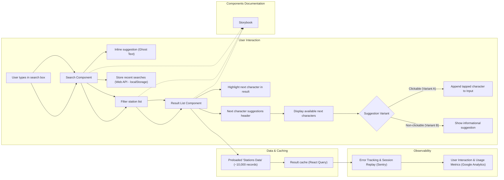

```mermaid
flowchart LR
  %% User Interaction Subgraph
  subgraph UI[User Interaction]
    A[User types in search box] --> B[Search Component]
    B --> C["Inline suggestion (Ghost Text)"]
    B --> D[Filter station list]
    D --> E[Result List Component]
    E --> F[Highlight next character in result]
    E --> G[Next character suggestions header]
    G --> H["Display available next characters"]
    H --> I{Suggestion Variant}
    I -- "Clickable (Variant A)" --> J[Append tapped character to Input]
    I -- "Non-clickable (Variant B)" --> K[Show informational suggestion]
    B --> N["Store recent searches (Web API - localStorage)"]
  end

  %% Data and Caching Subgraph
  subgraph DC[Data & Caching]
    L["Preloaded 'Stations Data' (~10,000 records)"]
    L --> M["Result cache (React Query)"]
  end

  %% Observability Subgraph
  subgraph OB[Observability]
    O["Error Tracking & Session Replay (Sentry)"]
    P["User Interaction & Usage Metrics (Google Analytics)"]
  end

  %% Components Documentation Subgraph (positioned underneath UI)
  subgraph CD[Components Documentation]
    spacer[" "]
    U[Storybook]
  end
  style spacer fill:transparent,stroke:transparent,stroke-width:0px,height:0px

  %% Main Flow Connections
  A --> B
  B --> D
  D --> E
  %% Connect UI to Data & Caching
  E --> L
  %% Connect Data & Caching to Observability
  M --> O
  O --> P

  %% Components Documentation connections (dotted arrows)
  B -.-> U
  D -.-> U
  E -.-> U
```